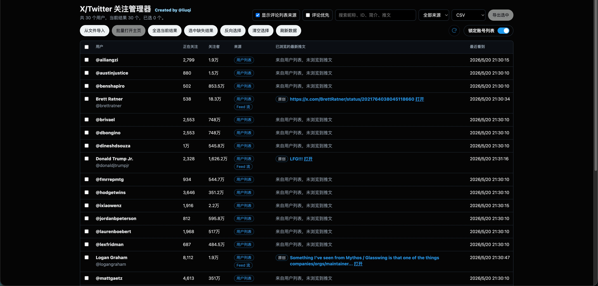

<div align="center">

# X/Twitter 关注管理器


Languages: [简体中文](README.md) · [English](README-en.md)

</div>

X/Twitter 关注管理器是一款用于 X/Twitter 网页版的 Chrome 扩展。它会把账号的正在关注数和粉丝数（关注者数）直接显示在页面上，并提供一个本地管理页，用来整理、筛选、导入和导出你在浏览过程中遇到的账号。

它适合用来整理正在关注的人、准备关注的人，或者临时刷到但想稍后再看的账号。

## 文档

- 隐私政策：[PRIVACY.md](PRIVACY.md)

## 功能

- 在 Feed 流和用户列表中直接显示账号的正在关注数和粉丝数（关注者数）。
- 支持开关控制 Feed 流、用户列表中的显示位置。
- 自动汇总浏览过或导入过的账号到本地用户管理页。
- 支持按昵称、handle、简介、网站和已浏览推文搜索。
- 支持按来源筛选账号：Feed 流、用户列表、评论列表、导入。
- 在管理页显示已浏览的最新推文，并标注原创、转推、评论或导入。
- 支持 CSV 和 Markdown 导出。
- 支持从 CSV 和 Markdown 导入账号名单。
- 支持批量打开选中账号主页，方便人工查看。
- 支持单标签顺序更新选中账号数据，避免一次性打开大量标签页。
- 支持锁定账号列表，只更新已有账号，不再新增浏览过程中遇到的新账号。
- 支持中文和英文界面切换。

## 安装

### 从源码加载

1. 打开 Chrome 或 Edge。
2. 进入 `chrome://extensions/` 或 `edge://extensions/`。
3. 开启右上角的“开发者模式”。
4. 点击“加载已解压的扩展程序”。
5. 选择本项目目录。
6. 打开或刷新 X/Twitter 页面。

如果安装前已经打开了 X/Twitter，建议刷新页面一次，让扩展脚本重新加载。

## 使用

打开 X/Twitter 后正常浏览页面。扩展会在支持的位置给账号增加一个统计标签，例如：

```text
388 正在关注 · 2.6万 关注者
```

Popup 弹窗提供常用入口：

- **Feed 流**：控制主页、个人主页、列表等信息流中的统计标签。
- **用户列表**：控制关注页、粉丝页、搜索用户结果、右侧用户模块等列表型账号条目。
- **锁定账号列表**：只更新当前已经捕获或导入的账号，不把浏览时新看到的账号加入管理页。
- **打开用户管理页**：进入独立管理页面，集中处理已捕获和已导入的账号。
- **重新扫描本页**：重新扫描当前 X/Twitter 页面。
- **清除缓存**：清空本地保存的账号数据。

通知页面不会显示统计标签，避免把点赞、回复和聚合通知里的头像误识别为普通用户列表。


## 用户管理页

在 Popup 中点击“打开用户管理页”，可以进入独立的本地管理页面。这里会显示扩展捕获或导入的账号信息：

- 昵称
- handle
- 正在关注数
- 粉丝数
- 来源
- 已浏览的最新推文
- 最近看到时间

管理页支持搜索、筛选、全选当前结果、选中缺失结果、反向选择、清空选择、导入、导出、批量打开主页和顺序更新。



## 来源说明

管理页会显示账号来源：

- **Feed 流**：账号出现在信息流或推文区域。
- **用户列表**：账号出现在关注页、粉丝页、搜索用户结果或右侧用户模块。
- **评论列表**：账号只从评论相关区域捕获。
- **导入**：账号来自导入文件，还没有被后续浏览数据更新。

如果一个导入账号后来又在 Feed 流、用户列表或评论列表中出现，新的来源会覆盖“导入”。“导入”不会和其他来源并列显示。

## 已浏览的最新推文

如果账号来自 Feed 流或评论列表，管理页会尽量记录你浏览到的最新内容，并在内容前标注类型：

- **原创**：普通原创推文。
- **转推**：转发内容。
- **评论**：评论或回复内容。
- **导入**：来自导入文件中的历史内容。

如果账号只来自用户列表或导入文件，管理页会说明当前还没有浏览到对应推文。

## 评论相关选项

- **显示评论列表来源**：控制是否显示只从评论列表捕获到的账号。如果同一个账号也出现在 Feed 流或用户列表中，关闭这个开关后它仍会保留。
- **评论优先**：当同一个账号同时有推文和评论记录时，优先在“已浏览的最新推文”中显示评论。这个开关只影响推文展示，不影响用户筛选。

## 导入与导出

默认导出格式是 CSV，也可以选择 Markdown。

CSV 导出包含：

- 昵称
- handle
- 用户 ID
- 主页链接
- 正在关注数
- 粉丝数
- 来源
- 简介
- 网站
- 首次看到时间
- 最近看到时间
- 最新推文类型
- 最新捕获推文
- 推文链接
- 捕获推文数量

主页链接是导入和批量打开主页时最重要的字段。只要导入文件里保留了 X/Twitter 主页链接，扩展就可以从链接中提取 handle。导入文件缺少正在关注数、粉丝数或推文内容时，对应字段会保持为空，后续重新浏览或顺序更新后会被补齐。

导入功能只负责导入名单、更新本地数据和打开主页。

## 顺序更新

顺序更新用于补齐账号的正在关注数和粉丝数，适合处理导入名单或缺失数据。

使用方式：

1. 在管理页选中需要更新的账号。
2. 点击刷新图标。
3. 扩展会打开一个专用的 X/Twitter 标签页。
4. 按顺序访问选中的账号主页。
5. 轻微滚动并等待页面渲染统计数据。
6. 将更新结果写回本地缓存。

关闭专用更新标签页会停止顺序更新。切回管理页查看更新结果不会中断任务。

## 权限与隐私

扩展使用的权限：

- `activeTab`：在你点击 Popup 操作时，与当前 X/Twitter 标签页通信。
- `storage`：在浏览器本地保存账号缓存和设置。
- `https://x.com/*`、`https://twitter.com/*`：在 X/Twitter 页面运行扩展脚本。

扩展不需要 X API key，不依赖第三方后端，也不会把捕获到的账号数据发送到外部服务器。账号数据保存在浏览器本地。

## 适用范围

- 主要支持 X/Twitter 网页版。
- X/Twitter 页面结构变化后，可能需要更新解析逻辑。
- 私密、异常、受限或被封禁账号可能无法显示完整数据。
- 如果页面在扩展启动前已经加载很久，刷新页面后通常能捕获到更多数据。
- 顺序更新依赖 X/Twitter 页面实际渲染出来的数据，不能保证所有账号都能补齐。
